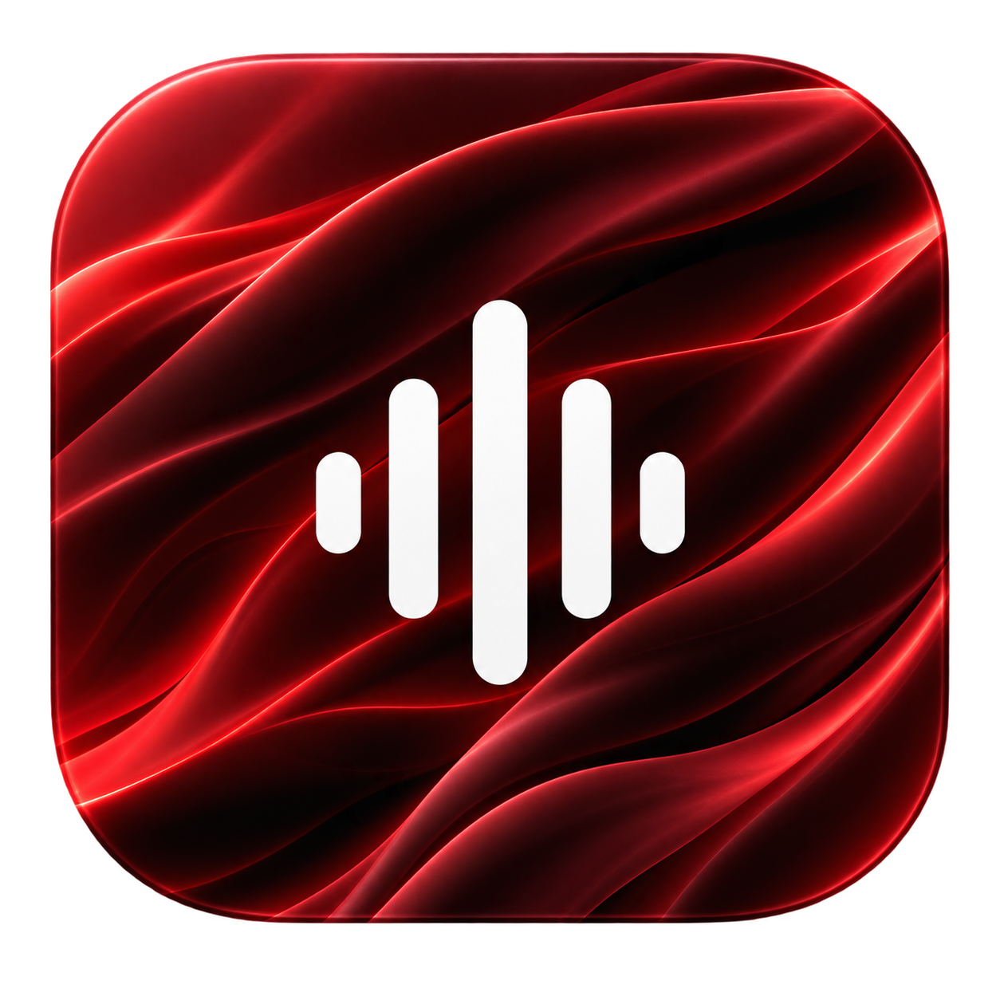

<div align="center">



# Reed

**Hold a shortcut, talk, and the words show up wherever you're typing.**
All on your Mac. Nothing leaves it.

[](LICENSE)
[](#install)
[](#install)
[](https://github.com/gustavoschewinski/reed/actions/workflows/ci.yml)

</div>

---

🎙️ **On-device dictation.** 25 languages, auto-detected. ~23× real time on an M3.
✍️ **Optional proofreading.** A second shortcut that fixes the typos before pasting.
🔒 **Private by default.** Audio is never written to disk and never sent anywhere.

## Install

Grab the DMG from [**Releases**](https://github.com/gustavoschewinski/reed/releases), open it, drag Reed to Applications. Apple silicon, macOS 14+.

> [!IMPORTANT]
> Reed isn't notarized yet, so the first launch needs one extra click. macOS will say it can't verify the developer. Right-click Reed in Applications and choose **Open**, or go to System Settings → Privacy & Security and click **Open Anyway**. Once, and never again.

A Homebrew cask lives in [`Casks/reed.rb`](Casks/reed.rb), but the tap isn't published yet, so use the DMG for now.

## First run

Reed asks for two permissions, downloads its speech model (~600 MB, with a real progress bar), and compiles it for the Neural Engine (about 20 seconds, once). Then you pick a shortcut and you're dictating. None of it repeats on later launches.

| Permission | Why |
| --- | --- |
| 🎤 **Microphone** | To hear you. Audio is captured only while you're actively dictating. |
| ⌨️ **Accessibility** | So Reed can paste into the app you're in, instead of leaving the text on the clipboard. |

Reed does **not** need Input Monitoring.

## Privacy

Transcription runs on-device with NVIDIA's Parakeet TDT v3 on the Neural Engine. **Nothing you say leaves your Mac.** Audio is thrown away the moment transcription finishes and is never written to disk. Only the resulting text is kept, in your local history.

Reed makes exactly two kinds of network request:

1. The one-time model download on first run.
2. If, and only if, you set up [proofreading](#proofreading), that shortcut sends the transcribed **text** (never the audio) to OpenAI.

Plain dictation never touches the network, whether or not proofreading is configured.

## Proofreading

An optional second shortcut. It records and transcribes exactly like the first one, then has an LLM fix the spelling and grammar before pasting, for the message you'd rather not send with a typo in it.

Set it up in **Settings → Proofreading**: record a shortcut, paste an [OpenAI API key](https://platform.openai.com/api-keys), pick a model. The list is fetched from your own account, so anything you have access to is selectable. `gpt-5.4-mini` is the default and a good one: proofreading takes it under a second, and it isn't a job that needs a big model.

Your API key goes in the macOS Keychain, not in Reed's preferences file. Until both a key and a model are saved, the shortcut just says so. It won't record a whole message and tell you at the end.

**How much it changes is up to you:**

| Mode | What it does |
| --- | --- |
| **Fix mistakes** *(default)* | Spelling, accents, grammar, agreement, tense, punctuation, capitalization. Nothing else: your wording, your tone and your jargon come back untouched. |
| **Fix and clarify** | All of the above, plus a lighter touch on sentences that are genuinely hard to follow. Some words will come back rewritten. |

Either way the prompt leaves technical writing alone: `merge`, `rebase`, `deploy`, `staging`, `PR`, file paths, code identifiers and URLs are treated as already correct. It never translates, so a message that mixes languages stays mixed. And it treats what you dictated as text to proofread, not as instructions. Dictating *"write an email to the client explaining the delay"* gets you that sentence, corrected, not an email.

If the proofread fails (no network, a rejected key, a model that doesn't exist), Reed pastes the raw transcription anyway and says what happened in the pill. **A proofread that didn't work never costs you the words you spoke.**

## Troubleshooting

<details>
<summary><b>The pill appears but nothing is ever typed or copied</b></summary>

Almost always the microphone permission, and it's the quietest failure Reed has: a denied or unavailable mic looks exactly like a quiet room. Check **System Settings → Privacy & Security → Microphone** and make sure Reed is enabled. Reed's own Settings shows a notice when this is the cause.
</details>

<details>
<summary><b>The text doesn't appear in my app</b></summary>

Accessibility permission was skipped or dismissed during setup. Reed still transcribes correctly. The text is just left on the clipboard instead of typed in. Enable Reed in **System Settings → Privacy & Security → Accessibility**, and use ⌘V in the meantime.
</details>

<details>
<summary><b>Nothing happens on the first launch</b></summary>

The 600 MB model download and the one-time Neural Engine compile (~20 s) both happen before Reed is ready. Watch for the progress bar rather than assuming it's hung.
</details>

<details>
<summary><b>The proofreading shortcut does nothing</b></summary>

It's inert until **Settings → Proofreading** has both an API key and a model saved. Press it and the pill will say so. If it's configured and still failing, the pill names the cause (rejected key, a model your account can't use, no network) and your text is pasted unproofread rather than lost.
</details>

<details>
<summary><b>None of the above: how do I see what's going on?</b></summary>

Launch Reed with debug logging on:

```bash
REED_DEBUG_LOG=1 /Applications/Reed.app/Contents/MacOS/Reed
```

This traces the dictation pipeline (recording start, mute/media-pause, transcription passes, delivery, overlay show/hide) to `~/Library/Logs/Reed/reed-debug.log`. It's off unless that variable is set, and a normal launch never creates the file. The log is safe to share: it records lengths, counts and state names, never the words you dictated.
</details>

## Known limitations

- **Non-QWERTY keyboard layouts.** Pasting synthesizes ⌘V using the physical key code for V on a US-ANSI keyboard. On Dvorak, Colemak and friends that paste may not fire in every app. The text is always still on the clipboard, so ⌘V (or Edit → Paste) recovers it.

## Building from source

Xcode 26.6+ and macOS 14+.

```bash
swift build
swift test
./Scripts/install.sh     # builds, installs to /Applications, launches
```

| Script | What it does |
| --- | --- |
| `build-app.sh` | Produces `build/Reed.app` |
| `install.sh` | Builds, then installs to `/Applications` and launches |
| `make-dmg.sh` | Produces `build/Reed.dmg` |
| `dev-cert.sh` | One-time local signing identity, so permission grants survive rebuilds |
| `make-icon.sh` | Regenerates `Resources/Reed.icns` from its source image |

Use `install.sh` for anything past a smoke test. `build-app.sh` leaves the app in `build/`, and running it from there means a second bundle with the same identifier competing with the installed one, which makes it easy to end up debugging a stale binary. `install.sh` also registers the app with LaunchServices and Spotlight, which a plain copy doesn't: Reed has no Dock icon, so ⌘-Space is how you open it.

The version in the built bundle comes from the git tag (or `REED_VERSION`), not from the checked-in `Info.plist`.

## Contributing

Reed is small and there's plenty left to build. Ideas, bug reports and pull requests are all welcome.

Some things that would be genuinely useful:

- 🌍 **More languages in the proofreading prompt.** The rules were written against Portuguese and English. If your language comes back wrong, open an issue with the before and after.
- ⌨️ **Non-QWERTY paste.** See [Known limitations](#known-limitations). Anyone who dictates on Dvorak or Colemak is better placed to fix this than I am.
- 🤖 **Other proofreading backends.** Local models, Anthropic, Ollama. The seam is already there: `Proofreader` takes an injected transport.
- 🐛 **Anything that misbehaves.** A dictation that came out wrong, a shortcut that didn't fire, an app that won't accept the paste.

Open an issue before a big change so we can agree on the shape of it. For a fix, just send the PR.

Every change needs `swift test` green (CI runs it), and new behaviour needs a test. The suite is fast and runs without a microphone, a network or the speech model: system calls are injected as closures everywhere, so keep it that way.

Comments in this codebase explain *why*, not *what*. If the reason a line exists isn't obvious from the line, write it down.

## Third-party licences

Reed bundles [FluidAudio](https://github.com/FluidInference/FluidAudio) (Apache-2.0) and [KeyboardShortcuts](https://github.com/sindresorhus/KeyboardShortcuts) (MIT). Their licence texts ship inside the app bundle and live in [THIRD_PARTY_LICENSES.md](THIRD_PARTY_LICENSES.md).

## License

MIT. See [LICENSE](LICENSE).
